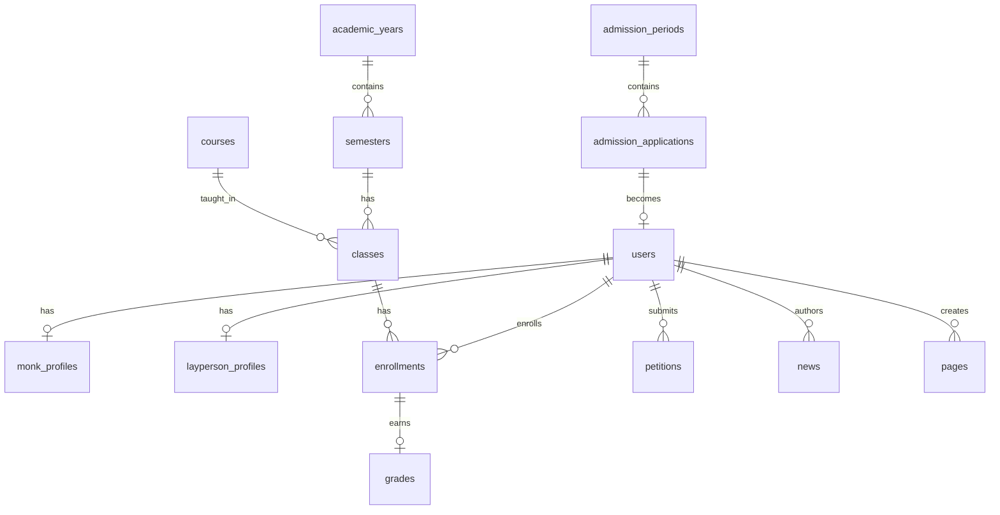

# BÁO CÁO ĐÁNH GIÁ PRODUCTION-READINESS
## E-SANGHA Web Portal - Học viện Phật giáo Nam tông Khmer

**Ngày đánh giá:** 10/01/2026  
**Vai trò:** Senior Software Architect & Security Auditor  
**Phiên bản:** 1.0

---

## MỤC LỤC

1. [Tổng quan dự án](#1-tổng-quan-dự-án)
2. [Gap Analysis - Phân tích thiếu hụt](#2-gap-analysis---phân-tích-thiếu-hụt)
3. [Technical Debt - Nợ kỹ thuật](#3-technical-debt---nợ-kỹ-thuật)
4. [Security Check - Kiểm định bảo mật](#4-security-check---kiểm-định-bảo-mật)
5. [Database Schema Review](#5-database-schema-review)
6. [Next Steps - Lộ trình kỹ thuật](#6-next-steps---lộ-trình-kỹ-thuật)
7. [Khuyến nghị Backend](#7-khuyến-nghị-backend)

---

## 1. TỔNG QUAN DỰ ÁN

### 1.1 Tech Stack hiện tại

| Layer | Công nghệ | Đánh giá |
|-------|-----------|----------|
| **Frontend** | Vite + React + TypeScript | ✅ Tốt |
| **Styling** | TailwindCSS + Custom CSS | ✅ Tốt |
| **Backend** | Django 5.x + DRF | ✅ Phù hợp |
| **Auth** | JWT (SimpleJWT) | ⚠️ Cần cải thiện |
| **Database** | PostgreSQL (Supabase) | ✅ Tốt |
| **API Docs** | drf-spectacular | ✅ Tốt |

### 1.2 Cấu trúc thư mục hiện tại

```
web_HVPGNTK/
├── frontend/
│   └── src/
│       ├── api/          # 5 modules (client, auth, cms, academic, admissions)
│       ├── pages/        # 8 pages (Home, About, News, StudentPortal, etc.)
│       ├── components/   # 6 components
│       ├── contexts/     # AuthContext
│       ├── hooks/        # useFetch
│       ├── types/        # auth.ts, academic.ts
│       └── router/       # routes.ts
├── backend/
│   ├── apps/
│   │   ├── users/        # User, MonkProfile, LaypersonProfile
│   │   ├── cms/          # Pages, News, Banners
│   │   ├── academic/     # Courses, Enrollments, Grades
│   │   ├── admissions/   # AdmissionPeriod, Applications
│   │   ├── petitions/    # E-Approval workflow
│   │   └── calendar_app/ # Events, Schedule
│   └── config/           # settings.py, urls.py
└── DATABASE_SCHEMA.md    # Schema documentation
```

---

## 2. GAP ANALYSIS - PHÂN TÍCH THIẾU HỤT

### 2.1 Frontend Gaps

#### 🔴 CRITICAL - Hardcode dữ liệu

| File | Dòng | Vấn đề | Mức độ |
|------|------|--------|--------|
| [StudentPortal.tsx](file:///e:/web_HVPGNTK/frontend/src/pages/StudentPortal.tsx#L175-L179) | 175-179 | Hardcode "K15 (2024-2028)", "Cử nhân Phật học" | 🔴 Critical |
| [StudentPortal.tsx](file:///e:/web_HVPGNTK/frontend/src/pages/StudentPortal.tsx#L192) | 192 | Hardcode tín chỉ "12/140" | 🔴 Critical |
| [Home.tsx](file:///e:/web_HVPGNTK/frontend/src/pages/Home.tsx#L8-L26) | 8-26 | Default settings hardcode | 🟡 Medium |
| [News.tsx](file:///e:/web_HVPGNTK/frontend/src/pages/News.tsx#L62) | 62 | Hardcode "1.2k lượt xem" | 🟡 Medium |

#### 🔴 CRITICAL - Thiếu Token Refresh Logic

```typescript
// Hiện tại trong client.ts (dòng 14-20):
client.interceptors.response.use(
    (response) => response,
    (error) => {
        console.error('API Error:', error.response || error.message);
        return Promise.reject(error);  // ❌ Không handle 401 → refresh token
    }
);
```

**Cần bổ sung:**
- Request interceptor để attach JWT token
- Response interceptor để handle 401 và auto-refresh
- Token storage & expiry management

#### 🟡 MEDIUM - Thiếu Loading States thống nhất

- [Home.tsx](file:///e:/web_HVPGNTK/frontend/src/pages/Home.tsx) - Không có global loading
- [News.tsx](file:///e:/web_HVPGNTK/frontend/src/pages/News.tsx#L12-L17) - Loading riêng lẻ
- Cần: Loading skeleton component hoặc React Suspense

#### 🟡 MEDIUM - Thiếu Error Boundary

- Không có React Error Boundary
- Lỗi API chỉ console.error, không hiển thị cho user
- Cần: Global error handling + Toast notifications

### 2.2 Backend Gaps

#### 🔴 CRITICAL - Thiếu Rate Limiting

```python
# settings.py - KHÔNG có rate limiting
REST_FRAMEWORK = {
    'DEFAULT_THROTTLE_CLASSES': [],  # ❌ THIẾU
    'DEFAULT_THROTTLE_RATES': {}     # ❌ THIẾU
}
```

#### 🟡 MEDIUM - Thiếu Audit Logging

- Không có audit trail cho actions quan trọng
- Cần: django-auditlog hoặc custom middleware

#### 🟡 MEDIUM - Thiếu Input Sanitization

- Serializers không có custom validation đủ mạnh
- Cần: bleach cho HTML content, strict validators

### 2.3 Các file/module CẦN BỔ SUNG

| Module | Mô tả | Ưu tiên |
|--------|-------|---------|
| `frontend/src/lib/tokenManager.ts` | Token storage & refresh logic | 🔴 P0 |
| `frontend/src/components/ErrorBoundary.tsx` | Global error handling | 🟡 P1 |
| `frontend/src/components/Toast.tsx` | Notification system | 🟡 P1 |
| `frontend/src/types/api.ts` | DTO cho tất cả API responses | 🟡 P1 |
| `backend/apps/core/middleware/audit.py` | Audit logging middleware | 🟡 P1 |
| `backend/apps/core/throttling.py` | Custom rate limits | 🔴 P0 |

---

## 3. TECHNICAL DEBT - NỢ KỸ THUẬT

### 3.1 Kiến trúc Frontend

> [!WARNING]
> **Vấn đề:** UI logic và business logic chưa tách biệt rõ ràng

**Hiện tại:**
```
pages/StudentPortal.tsx
├── Auth logic (login/logout)
├── Data fetching (academicApi calls)
├── UI rendering
└── Event handlers
```

**Cần refactor theo pattern:**
```
features/student-portal/
├── hooks/
│   └── useStudentDashboard.ts    # Data fetching + state
├── components/
│   ├── StudentStats.tsx          # Pure UI
│   ├── EnrollmentTable.tsx       # Pure UI
│   └── StudentSidebar.tsx        # Pure UI
└── index.tsx                     # Container (composition)
```

### 3.2 Đánh giá Clean Architecture

| Tiêu chí | Hiện tại | Mục tiêu | Đánh giá |
|----------|----------|----------|----------|
| Separation of Concerns | ⚠️ Partial | ✅ Full | UI + Logic mixed trong pages |
| Dependency Inversion | ❌ Không | ✅ Có | API calls trực tiếp trong components |
| Single Responsibility | ⚠️ Partial | ✅ Full | Pages làm quá nhiều việc |
| Type Safety | ⚠️ Partial | ✅ Full | Thiếu type cho API responses |

### 3.3 Cấu trúc thư mục đề xuất (Frontend)

```
frontend/src/
├── app/                      # App-level configs
│   ├── providers.tsx         # All React providers
│   └── router.tsx            # Route definitions
├── features/                 # Feature-based modules
│   ├── auth/
│   │   ├── api/              # Auth API calls
│   │   ├── hooks/            # useAuth, useLogin
│   │   ├── components/       # LoginForm, LogoutButton
│   │   ├── types/            # AuthState, User
│   │   └── index.ts          # Public exports
│   ├── news/
│   │   ├── api/
│   │   ├── hooks/
│   │   ├── components/
│   │   └── types/
│   └── student-portal/
│       ├── api/
│       ├── hooks/
│       └── components/
├── shared/                   # Shared utilities
│   ├── components/           # Button, Modal, Toast
│   ├── hooks/                # useDebounce, usePagination
│   ├── lib/                  # tokenManager, api-client
│   └── types/                # Common types
├── pages/                    # Route pages (thin wrappers)
│   ├── Home.tsx
│   ├── News.tsx
│   └── StudentPortal.tsx
└── styles/
    └── index.css
```

### 3.4 Những quyết định SAI HƯỚNG dài hạn

| Vấn đề | Impact | Solution |
|--------|--------|----------|
| Inline styles trong Home.tsx (500+ lines) | Khó maintain, không reusable | Extract to Tailwind classes hoặc CSS modules |
| useEffect cho data fetching | Race conditions, cleanup issues | React Query hoặc SWR |
| Không có state management | Props drilling ở scale lớn | Zustand hoặc Redux Toolkit (nếu cần) |

---

## 4. SECURITY CHECK - KIỂM ĐỊNH BẢO MẬT

### 4.1 OWASP Top 10 Assessment

| # | Vulnerability | Status | Khuyến nghị |
|---|---------------|--------|-------------|
| A01 | **Broken Access Control** | ⚠️ RISK | RBAC chỉ check role, không granular permissions |
| A02 | **Cryptographic Failures** | ✅ OK | JWT + HTTPS (cần verify production) |
| A03 | **Injection** | ⚠️ RISK | Django ORM an toàn, nhưng thiếu input sanitization cho CMS content |
| A04 | **Insecure Design** | ⚠️ RISK | Thiếu rate limiting |
| A05 | **Security Misconfiguration** | 🔴 CRITICAL | SECRET_KEY có default fallback |
| A06 | **Vulnerable Components** | ✅ OK | Cần check dependencies regularly |
| A07 | **Auth Failures** | ⚠️ RISK | Không có brute-force protection |
| A08 | **Data Integrity Failures** | ✅ OK | JWT verified by simplejwt |
| A09 | **Logging Failures** | ⚠️ RISK | Basic logging, thiếu security events |
| A10 | **SSRF** | ✅ OK | Không có user-controlled URL fetch |

### 4.2 Authentication & Authorization

```python
# Hiện tại trong settings.py:
SECRET_KEY = os.environ.get('DJANGO_SECRET_KEY', 'django-insecure-change-this-in-production')
#                                                 ^^^^^^^^^^^^^^^^^^^^^^^^^^^^^^^^^^^^^^^^
#                                                 🔴 CRITICAL: Default fallback = KHÔNG AN TOÀN
```

**Khuyến nghị:**
```python
# settings.py - MUST FIX
import os
from django.core.exceptions import ImproperlyConfigured

def get_env_var(var_name):
    value = os.environ.get(var_name)
    if not value:
        raise ImproperlyConfigured(f"Set the {var_name} environment variable")
    return value

SECRET_KEY = get_env_var('DJANGO_SECRET_KEY')  # Fail nếu không set
```

### 4.3 CORS Configuration

```python
# Hiện tại:
CORS_ALLOWED_ORIGINS = os.getenv(
    'CORS_ALLOWED_ORIGINS',
    'http://localhost:3000,http://127.0.0.1:3000'  # ⚠️ Default localhost
).split(',')
```

**Khuyến nghị:**
- ✅ CORS_ALLOW_CREDENTIALS = True (đã có)
- ⚠️ Cần validate CORS origins từ env trong production
- ⚠️ Không nên có default localhost trong production

### 4.4 CSRF Protection

| Context | Status | Note |
|---------|--------|------|
| Django Admin | ✅ Enabled | CsrfViewMiddleware active |
| DRF APIs | ⚠️ Partial | JWT auth không dùng CSRF, nhưng Session auth cần |
| Frontend Forms | ⚠️ Missing | Không gửi CSRF token từ frontend |

### 4.5 Rate Limiting - CẦN THÊM

```python
# Thêm vào settings.py:
REST_FRAMEWORK = {
    # ... existing config ...
    'DEFAULT_THROTTLE_CLASSES': [
        'rest_framework.throttling.AnonRateThrottle',
        'rest_framework.throttling.UserRateThrottle'
    ],
    'DEFAULT_THROTTLE_RATES': {
        'anon': '100/hour',      # Anonymous users
        'user': '1000/hour',     # Authenticated users
        'login': '5/minute',     # Login attempts
    }
}
```

### 4.6 Input Validation & Output Sanitization

**Vấn đề với CMS Content:**
```python
# cms/models.py - News.content_vi là TextField
# Nếu cho phép HTML, cần sanitize!

# Khuyến nghị trong serializers.py:
import bleach

class NewsSerializer(serializers.ModelSerializer):
    def validate_content_vi(self, value):
        allowed_tags = ['p', 'br', 'strong', 'em', 'ul', 'ol', 'li', 'a', 'h2', 'h3']
        allowed_attrs = {'a': ['href', 'title']}
        return bleach.clean(value, tags=allowed_tags, attributes=allowed_attrs)
```

### 4.7 Secrets Management

| Secret | Hiện tại | Khuyến nghị |
|--------|----------|-------------|
| DJANGO_SECRET_KEY | .env file | ✅ OK (không commit .env) |
| DATABASE_URL | .env file | ✅ OK |
| JWT Signing Key | Dùng SECRET_KEY | ⚠️ Nên tách riêng |
| API Keys (nếu có) | ❓ Unknown | Dùng Vault hoặc env vars |

---

## 5. DATABASE SCHEMA REVIEW

### 5.1 Schema hiện tại - Điểm mạnh

✅ **Tốt:**
- UUID primary keys (scale-friendly)
- Proper foreign key constraints
- JSONB cho dữ liệu linh hoạt (place_of_birth, schedule)
- Check constraints cho enums
- Timestamps (created_at, updated_at)

### 5.2 Schema - Điểm cần cải thiện

#### Thiếu Audit Tables

```sql
-- CẦN THÊM:
CREATE TABLE audit_logs (
    id UUID PRIMARY KEY DEFAULT gen_random_uuid(),
    user_id UUID REFERENCES users(id),
    action VARCHAR(50) NOT NULL,           -- 'CREATE', 'UPDATE', 'DELETE', 'LOGIN', 'LOGOUT'
    resource_type VARCHAR(100) NOT NULL,   -- 'admission_application', 'grade', etc.
    resource_id UUID,
    old_values JSONB,
    new_values JSONB,
    ip_address INET,
    user_agent TEXT,
    created_at TIMESTAMP DEFAULT NOW()
);

CREATE INDEX idx_audit_user ON audit_logs(user_id);
CREATE INDEX idx_audit_resource ON audit_logs(resource_type, resource_id);
CREATE INDEX idx_audit_time ON audit_logs(created_at);
```

#### Thiếu Granular Permissions

```sql
-- CẦN THÊM cho RBAC nâng cao:
CREATE TABLE permissions (
    id UUID PRIMARY KEY DEFAULT gen_random_uuid(),
    code VARCHAR(100) UNIQUE NOT NULL,     -- 'admission.approve', 'grade.edit'
    name_vi VARCHAR(200),
    resource VARCHAR(50),                   -- 'admission', 'grade', 'news'
    action VARCHAR(20)                      -- 'create', 'read', 'update', 'delete', 'approve'
);

CREATE TABLE role_permissions (
    id UUID PRIMARY KEY DEFAULT gen_random_uuid(),
    role VARCHAR(50) NOT NULL,
    permission_id UUID REFERENCES permissions(id),
    UNIQUE(role, permission_id)
);

CREATE TABLE user_permissions (  -- Cho delegations đặc biệt
    id UUID PRIMARY KEY DEFAULT gen_random_uuid(),
    user_id UUID REFERENCES users(id),
    permission_id UUID REFERENCES permissions(id),
    granted_by UUID REFERENCES users(id),
    expires_at TIMESTAMP,
    UNIQUE(user_id, permission_id)
);
```

### 5.3 Diagram quan hệ cốt lõi



---

## 6. NEXT STEPS - LỘ TRÌNH KỸ THUẬT

### Phase 1: Security Hardening (1-2 tuần)

| # | Task | Files | Priority |
|---|------|-------|----------|
| 1.1 | Bỏ default SECRET_KEY fallback | [settings.py](file:///e:/web_HVPGNTK/backend/config/settings.py#L20) | 🔴 P0 |
| 1.2 | Thêm Rate Limiting | settings.py, custom throttles | 🔴 P0 |
| 1.3 | Implement Token Refresh interceptor | frontend/src/api/client.ts | 🔴 P0 |
| 1.4 | Thêm Brute-force protection cho Login | users/views.py | 🟡 P1 |
| 1.5 | Thêm Audit Logging | core/middleware/audit.py | 🟡 P1 |

### Phase 2: Code Quality (2-3 tuần)

| # | Task | Impact |
|---|------|--------|
| 2.1 | Refactor StudentPortal - loại bỏ hardcode | Production-ready data |
| 2.2 | Extract inline styles → Tailwind classes | Maintainability |
| 2.3 | Implement React Query cho data fetching | Better UX, caching |
| 2.4 | Thêm Error Boundary + Toast system | User-friendly errors |
| 2.5 | Tạo đầy đủ TypeScript types cho API | Type safety |

### Phase 3: Feature Completion (3-4 tuần)

| # | Task | Business Value |
|---|------|----------------|
| 3.1 | Complete Student Dashboard | Xem điểm thực tế |
| 3.2 | Implement Course Registration flow | Đăng ký môn online |
| 3.3 | Implement Petition (E-Approval) workflow | Quy trình đơn từ |
| 3.4 | Admin CMS cho quản lý nội dung | Biên tập viên sử dụng |

### Phase 4: Production Deployment (1 tuần)

| # | Task |
|---|------|
| 4.1 | SSL/HTTPS configuration |
| 4.2 | Environment variables validation |
| 4.3 | Database backup strategy |
| 4.4 | Monitoring & Alerting (Sentry, etc.) |
| 4.5 | CI/CD pipeline |

---

## 7. KHUYẾN NGHỊ BACKEND

### Django vs FastAPI

| Tiêu chí | Django | FastAPI |
|----------|--------|---------|
| **Ecosystem** | ✅ Rất lớn, mature | ⚠️ Nhỏ hơn |
| **Admin Panel** | ✅ Built-in, powerful | ❌ Không có |
| **ORM** | ✅ Django ORM (tốt) | External (SQLAlchemy) |
| **Auth/Permissions** | ✅ Built-in | ⚠️ Tự implement |
| **DRF** | ✅ Excellent serializers | Pydantic (khác biệt) |
| **Performance** | ⚠️ OK | ✅ Nhanh hơn 2-3x |
| **Async** | ⚠️ Partial (Django 4.1+) | ✅ Native async |
| **Learning Curve** | ⚠️ Steeper | ✅ Dễ hơn |

### Khuyến nghị: **GIỮ DJANGO**

**Lý do:**
1. ✅ Đã có backend Django hoạt động với đầy đủ models, serializers, views
2. ✅ Django Admin sẵn sàng cho content editors
3. ✅ DRF + SimpleJWT đã configured đúng
4. ✅ dj-database-url, CORS, logging đã setup
5. ⚠️ Chuyển sang FastAPI = viết lại 100% backend code → tốn 2-4 tuần

**Nếu cần tối ưu performance sau này:**
- Thêm caching (Redis)
- Async views cho I/O-heavy endpoints
- CDN cho static assets

---

## KẾT LUẬN

### Điểm số Production-Readiness: **55/100**

| Category | Score | Max |
|----------|-------|-----|
| **Security** | 12 | 25 |
| **Code Quality** | 15 | 25 |
| **Architecture** | 13 | 20 |
| **Feature Completeness** | 10 | 20 |
| **Documentation** | 5 | 10 |

### Verdict

> [!CAUTION]
> **CHƯA SẴN SÀNG CHO PRODUCTION**
> 
> Dự án có nền tảng tốt (Django + React + TypeScript) nhưng còn nhiều GAP về security và code quality cần khắc phục trước khi triển khai cho tổ chức tôn giáo - giáo dục với dữ liệu nhạy cảm.

### Top 5 Actions Immediate

1. 🔴 **Bỏ default SECRET_KEY** - Bắt buộc trước production
2. 🔴 **Thêm Rate Limiting** - Chống DDoS/brute-force
3. 🔴 **Token Refresh Logic** - UX khi token hết hạn
4. 🟡 **Loại bỏ hardcode data** - Dữ liệu thực từ API
5. 🟡 **Audit Logging** - Traceability cho compliance

---

*Báo cáo được thực hiện bởi: AI Senior Software Architect*  
*Framework: OWASP Top 10, Clean Architecture, SOLID Principles*
