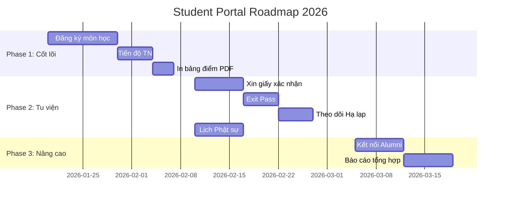

# KẾ HOẠCH CẢI THIỆN CỔNG THÔNG TIN TĂNG SINH
## Học viện Phật giáo Nam tông Khmer Cần Thơ

**Document Version:** 2.0  
**Ngày lập:** 15/01/2026  
**Người soạn:** Development Team  
**Cần phê duyệt:** Ban Giám hiệu, Hòa thượng, Thượng tọa

---

## MỤC LỤC

- [1. HIỆN TRẠNG \u0026 VẤN ĐỀ](#1-hiện-trạng--vấn-đề)
- [2. BỐI CẢNH HỌC VIỆN](#2-bối-cảnh-học-viện)
- [3. ĐẶC THÙ PHẬT GIÁO NAM TÔNGKHMER](#3-đặc-thù-phật-giáo-nam-tôngkhmer)
- [4. SO SÁNH VỚI CHUẨN QUỐC TẾ](#4-so-sánh-với-chuẩn-quốc-tế)
- [5. KẾ HOẠCH TRIỂN KHAI (3 PHASES)](#5-kế-hoạch-triển-khai-3-phases)
- [6. CHI TIẾT PHASE 1 - C Ốt Lõi](#6-chi-tiết-phase-1---cốt-lõi)
- [7. CHI TIẾT PHASE 2 - Tu Viện](#7-chi-tiết-phase-2---tu-viện)
- [8. CHI TIẾT PHASE 3 - Nâng Cao](#8-chi-tiết-phase-3---nâng-cao)
- [9. YÊU CẦU KỸ THUẬT](#9-yêu-cầu-kỹ-thuật)
- [10. MA TRẬN PHÂN QUYỀN](#10-ma-trận-phân-quyền)
- [11. CÂU HỎI CẦN Ý KIẾN BGH](#11-câu-hỏi-cần-ý-kiến-bgh)
- [12. PHỤ LỤC](#12-phụ-lục)

---

## 1. HIỆN TRẠNG \u0026 VẤN ĐỀ

### 1.1. Đã sửa (từ audit report trước)

| # | Vấn đề | Trạng thái |
|---|--------|------------|
| 1 | Frontend gọi sai `my_enrollments` endpoint | ✅ ĐÃ SỬA |
| 2 | TypeScript types không khớp (`year_code`, `semester_number`) | ✅ ĐÃ SỬA |
| 3 | UserSerializer thiếu `monk_profile` nested | ✅ ĐÃ SỬA |
| 4 | API `getCurrentSemester()` chưa có | ✅ ĐÃ SỬA |
| 5 | Login credentials sai (`login_id`) | ✅ ĐÃ SỬA |

### 1.2. Chức năng hiện có

**✅ Đã hoàn thành:**
- Đăng nhập (Mã SV / Email / SĐT)
- Xem điểm \u0026 GPA
- Xem lịch học
- Thống kê tín chỉ

**❌ Còn thiếu (Kế hoạch này):**
- Đăng ký môn học hoàn chỉnh
- Tiến độ tốt nghiệp
- In bảng điểm PDF
- Xin giấy xác nhận
- Quản lý Hạ lạp (Vassa)
- Exit Pass (Xin phép rời chùa)
- Lịch Phật sự

---

## 2. BỐI CẢNH HỌC VIỆN

### 2.1. Thông tin cơ bản
- **Tên:** Học viện Phật giáo Nam tông Khmer Cần Thơ
- **Thành lập:** 2006
- **Địa chỉ:** Khu vực 12, Châu Văn Liêm, Ô Môn, Cần Thơ
- **Diện tích:** ~7 ha
- **Phạm vi:** 8 tỉnh Nam Bộ (Cần Thơ, An Giang, Kiên Giang, Sóc Trăng, Trà Vinh, Bạc Liêu, Hậu Giang, Cà Mau)

### 2.2. Chương trình đào tạo
- **Bằng cấp:** Cử nhân Phật học Pali-Khmer
- **Thời gian:** 4 năm
- **Tổng môn học:** 51 môn
- **Tổng tín chỉ:** 228 tín chỉ
- **Đối tượng:** Tăng sinh Khmer đã thọ giới (Sāmaṇera hoặc Bhikkhu)

### 2.3. Số lượng
- **Hiện tại:** ~70 Tăng sinh/khóa
- **Tốt nghiệp:** 300+ (đến năm 2026)
- **Khóa:** Đang đào tạo Khóa XVI

---

## 3. ĐẶC THÙ PHẬT GIÁO NAM TÔNG/KHMER

### 3.1. Khác biệt với Đại học thường

| Khía cạnh | Đại học thường | HVPGNTK |
|-----------|----------------|---------|
| **Sinh viên** | Đa dạng | **Tăng sinh** (đã thọ giới) |
| **Nơi ở** | Tự do, KTX | **Nội trú** tại chùa học viện |
| **Học phí** | Có | **Miễn phí** (do Giáo hội hỗ trợ) |
| **Niên khóa** | Theo năm dương | Tinh **Hạ lạp** (Vassa) |
|  **Môn học** | Đa ngành | **Tam Tạng + Pali + Khmer** |
| **Giới luật** | Nội quy trường | **Vinaya** (227 giới cho Bhikkhu) |
| **Lịch nghỉ** | Hè 2-3 tháng | **An cư Kiết hạ** (Vassa - 3 tháng) |
| **Đánh giá** | Có rating GV | **Không** (văn hóa tôn sư) |

### 3.2. Cấu trúc môn học theo Tam Tạng

**51 môn / 228 tín chỉ** phân theo:

1. **Vinaya Pitaka (Luật Tạng)** - 15 môn (~60 tín chỉ)
   - Tứ Phần Luật, Giới học, Tác pháp yết ma, Pāṭimokkha
   
2. **Sutta Pitaka (Kinh Tạng)** - 20 môn (~80 tín chỉ)
   - Trường A-hàm, Trung A-hàm, Tương ưng, Tăng chi
   
3. **Abhidhamma Pitaka (Luận Tạng)** - 10 môn (~40 tín chỉ)
   - Vi diệu pháp, Tâm sở học, Dhammasaṅgaṇī
   
4. **Pali Language** - 4 môn (16 tín chỉ)
   - Pali I (Sơ), II (Trung), III (Cao), IV (Chuyên)
   
5. **Khmer Culture \u0026 Languages** - 2 môn (8 tín chỉ)
   - Văn học Khmer, Văn hóa Nam Bộ

**Quy tắc học tập:**
- Vinaya phải học trước Sutta (prerequisite logic)
- Pali Sơ cấp (I) bắt buộc cho năm 1
- Không OC ký môn trong thời gian Vassa

### 3.3. Hệ thống Hạ lạp (Vassa)

**Định nghĩa:** Số năm tu hành, tính từ ngày thọ Cụ túc giới (Upasampada)

**Cách tính:**
- **Bắt đầu:** Ngày Asalha Puja (Rằm tháng 8 âm lịch ~ tháng 7 dương)
- **Kết thúc:** Pavarana (Rằm tháng 11 âm lịch ~ tháng 10 dương)
- **Quy tắc:** Mỗi năm qua 1 kỳ Vassa = +1 Hạ

**Ví dụ thực tế:**
```
Thọ giới: 15/07/2023
├─ Asalha 2023: 03/08/2023 → Vassa I (2023)
├─ Asalha 2024: 21/07/2024 → Vassa II (2024)
├─ Asalha 2025: 11/07/2025 → Vassa III (2025)
└─ Hiện tại (15/01/2026): 3 Hạ lạp
```

**Ý nghĩaạ lạp:**
- Quyết định **seniority** trong Tăng đoàn
- Ảnh hưởng đến **quyền được ngồi**, thứ tự tụng kinh
- Thể hiện **trình độ tu tập**

### 3.4. Giới luật Vinaya

**Bhikkhu (Tỷ-kheo - Tăng sĩ nam):**
- **227 giới** (Pāṭimokkha)
- Tụng giới mỗi **Uposatha** (Rằm và mùng 1 âm lịch)

**Sāmaṇera (Sa-di - Chú tiểu):**
- **10 giới** (Dasa Sīla)
- Tuổi tối thiểu: 7 tuổi (thực tế >13)

**Ảnh hưởng đến Portal:**
- Hạnh kiểm được chấm dựa trên **tuân thủ Vinaya**
- Không có "khảo sát đánh giá giảng viên" (không phù hợp văn hóa)

---

## 4. SO SÁNH VỚI CHUẨN QUỐC TẾ

### 4.1. MCU Thailand (Mahachulalongkornrajavidyalaya dục)

**✅ Học hỏi:**
- Online course registration với prerequisite check
- Student ID card điện tử (QR code)
- Online transcript request

**❌ Không áp dụng:**
- Payment gateway (MCU có học phí, HVPGNTK miễn phí)
- E-Learning LMS với video (Không phù hợp văn hóa tu viện truyền thống)

### 4.2. Nalanda University India

**✅ Học hỏi:**
- **Exit/Entry Pass System** cho sinh viên nội trú
- Student Affairs portal
- Buddhist calendar integration

**⚠️ Chỉnh sửa theo HVP:**
- Nalanda là đại học nghiên cứu, HVPGNTK là tu viện đậm Theravada hơn

### 4.3. Đại học Việt Nam (VNU, UEH, etc.)

**✅ Học hỏi:**
- Modern UI/UX design
- Mobile responsive
- Real-time notifications

**❌ Không áp dụng:**
- Course evaluation/rating (Không phù hợp văn hóa tôn sư trọng đạo)
- Advanced mobile app (Đã có app riêng)
- AI chatbot (Chưa cần thiết)

---

## 5. KẾ HOẠCH TRIỂN KHAI (3 PHASES)

### Timeline Tổng quan



### Tổng quan các Phase

| Phase | Thời gian | Số tính năng | Mức độ |
|-------|-----------|--------------|--------|
| **Phase 1** | 2-3 tuần | 4 tính năng | ⭐⭐⭐ CẤP THIẾT |
| **Phase 2** | 3-4 tuần | 4 tính năng | ⭐⭐ QUAN TRỌNG |
| **Phase 3** | 1 tháng | 3 tính năng | ⭐ BỔ SUNG |

---

## 6. CHI TIẾT PHASE 1 - CỐT LÕI

### 6.1. Đăng ký môn học hoàn chỉnh

**Đặc điểm:**
- Tăng sinh tự đăng ký (nhưng cần BGH duyệt - xem mục 11.1)
- Kiểm tra prerequisite (VD: Vinaya I → Vinaya II)
- Kiểm tra Pali level (VD: Sutta II yêu cầu Pali I)
- Kiểm tra trùng lịch
- Max 25 tín chỉ/học kỳ
- **Không cho đăng ký trong Vassa** (cần confirm BGH - mục 11.2)

**Backend Models cần bổ sung:**

```python
# academic/models.py
class Course(models.Model):
    # Existing fields...
    
    knowledge_block = models.CharField(
        max_length=20,
        choices=[
            ('VINAYA', 'Luật Tạng'),
            ('SUTTA', 'Kinh Tạng'),
            ('ABHIDHAMMA', 'Luận Tạng'),
            ('PALI', 'Ngôn ngữ Pali'),
            ('KHMER', 'Văn hóa Khmer'),
        ],
        help_text="Phân loại theo Tam Tạng"
    )
    pali_level_required = models.IntegerField(
        null=True, blank=True,
        choices=[(1,'I'), (2,'II'), (3,'III'), (4,'IV')],
        help_text="Yêu cầu trình độ Pali tối thiểu"
    )
    cannot_register_during_vassa = models.BooleanField(
        default=False,
        help_text="Cấm đăng ký trong thời gian An cư"
    )
```

**APIs cần thêm:**

```python
# academic/views.py

class CourseRegistrationViewSet(viewsets.ViewSet):
    @action(detail=False, methods=['post'])
    def enroll(self, request):
        """
        Đăng ký môn học
        - Check prerequisite
        - Check Pali level
        - Check trùng lịch
        - Check max credits
        - Check Vassa period
        """
        pass
    
    @action(detail=False, methods=['get'])
    def available_classes(self, request):
        """
        Lấy danh sách lớp có thể đăng ký
        - Filter theo năm học hiện tại
        - Filter theo điều kiện Tăng sinh
        """
        pass
```

**UI Components:**

```tsx
<CourseCard>
  <KnowledgeBlock tag="Vinaya Pitaka" color="amber" />
  
  <CourseInfo>
    <h3>VIN301 - Tứ Phần Luật</h3>
    <Credits>4 tín chỉ</Credits>
    <Instructor>Thầy Tuệ Minh</Instructor>
  </CourseInfo>
  
  <Requirements>
    <Prerequisite>
      ✅ VIN201 (Đã hoàn thành)
    </Prerequisite>
    <PaliLevel>
      ⚠️ Yêu cầu: Pali II (Bạn: Pali I)
    </PaliLevel>
  </Requirements>
  
  <Schedule>
    📅 Thứ 2, 7:00 - 9:00
    📍 Phòng B202
  </Schedule>
  
  <EnrollButton disabled={!meetsRequirements}>
    Đăng ký
  </EnrollButton>
</CourseCard>
```

---

### 6.2. Tiến độ tốt nghiệp

**Yêu cầu:**
- [ ] Tính % hoàn thành (credits earned / 228)
- [ ] Hiển thị số Hạ lạp hiện tại
- [ ] Kiểm tra Pali cấp II
- [ ] Kiểm tra Hạnh kiểm TB >= 7.0
- [ ] Danh sách môn còn thiếu (phân theo Tam Tạng)

**API:**

```python
@api_view(['GET'])
@permission_classes([IsAuthenticated])
def graduation_progress(request):
    student = request.user
    monk_profile = student.monk_profile
    
    # Tính credits
    enrollments = Enrollment.objects.filter(
        student=student,
        status='COMPLETED'
    )
    earned_credits = sum(e.class_instance.course.credits for e in enrollments)
    
    # Check requirements
    pali_level = monk_profile.pali_level
    conduct_avg = calculate_conduct_average(student)
    
    # Môn còn thiếu
    remaining_courses = Course.objects.exclude(
        id__in=[e.class_instance.course_id for e in enrollments]
    )
    
    return Response({
        'total_credits': 228,
        'earned_credits': earned_credits,
        'percentage': round(earned_credits / 228 * 100, 1),
        'vassa_count': monk_profile.vassa_count,
        'pali_level': pali_level,
        'pali_requirement_met': pali_level >= 2,
        'conduct_avg': conduct_avg,
        'conduct_requirement_met': conduct_avg >= 7.0,
        'remaining_courses': CourseSerializer(remaining_courses, many=True).data
    })
```

**UI:**

```tsx
<GraduationDashboard>
  <ProgressSection>
    <DonutChart>
      <CompletedCredits>156 / 228</CompletedCredits>
      <Percentage>68.4%</Percentage>
    </DonutChart>
    
    <VassaBadge>
      🙏 {vassaCount} Hạ lạp
    </VassaBadge>
  </ProgressSection>
  
  <RequirementsChecklist>
    ✅ Tín chỉ: 156/228 (68%)
    ✅ Pali: Cấp II ✓
    ⚠️ Hạnh kiểm: 8.2/10 ✓
    ⏳ Còn 15 môn
  </RequirementsChecklist>
  
  <KnowledgeBlocksProgress>
    <Block name="Vinaya" completed={12} total={15} />
    <Block name="Sutta" completed={18} total={20} />
    <Block name="Abhidhamma" completed={8} total={10} />
    <Block name="Pali" completed={4} total={4} status="done" />
  </KnowledgeBlocksProgress>
</GraduationDashboard>
```

---

### 6.3. Xem \u0026 In bảng điểm PDF

**Đặc thù Phật giáo:**
- Hiển thị **Pháp danh Khmer**
- Hiển thị **Hạ lạp** tại thời điểm học
- Hiển thị **Chùa trực thuộc**
- Điểm **Pali** riêng biệt
- Điểm **Hạnh kiểm** mỗi kỳ

**PDF Template:**

```
╔═══════════════════════════════════════════════╗
║   HỌC VIỆN PHẬT GIÁO NAM TÔNG KHMER           ║
║   Theravada Buddhist Academy for Khmer People  ║
║   Khu vực 12, Châu Văn Liêm, Ô Môn, Cần Thơ   ║
╠═══════════════════════════════════════════════╣
║                                               ║
║         BẢNG ĐIỂM CÁ NHÂN                     ║
║         TRANSCRIPT OF RECORDS                  ║
║                                               ║
╠═══════════════════════════════════════════════╣
║ Pháp danh / Dharma Name:                      ║
║   [Khmer Script] ភិក្ខុ មិញ តឺ                  ║
║   Thích Minh Tuệ                              ║
║                                               ║
║ Mã SV / Student ID: TS2024001                 ║
║ Hạ lạp / Vassa: 3 (tính đến 15/01/2026)       ║
║ Khóa / Cohort: XIV                            ║
║ Chùa trực thuộc: Chùa Pothisomron, Sóc Trăng  ║
╠═══════════════════════════════════════════════╣
║ HỌC KỲ I - NĂM HỌC 2024-2025                  ║
║ SEMESTER I - ACADEMIC YEAR 2024-2025          ║
╠════╦═════════════╦═══╦═════╦═════╦══════╦════╣
║ STT║ MÔN HỌC    ║TC ║ GK  ║ CK  ║ TỔNG ║ XL ║
║ NO ║ COURSE     ║CR ║ MID ║ FNL ║ TOTAL║ GR ║
╠════╬═════════════╬═══╬═════╬═════╬══════╬════╣
║ 1  ║ VIN201     ║ 4 ║ 8.5 ║ 9.0 ║ 8.8  ║ A  ║
║    ║ Giới học I ║   ║     ║     ║      ║    ║
╠════╬═════════════╬═══╬═════╬═════╬══════╬════╣
║ 2  ║ SUT101     ║ 3 ║ 8.0 ║ 8.5 ║ 8.3  ║ A  ║
║    ║ Phật lịch  ║   ║     ║     ║      ║    ║
╠════╬═════════════╬═══╬═════╬═════╬══════╬════╣
║ 3  ║ PAL101     ║ 3 ║ 7.5 ║ 8.0 ║ 7.8  ║ B+ ║
║    ║ Pali Sơ cấp║   ║     ║     ║      ║    ║
╚════╩═════════════╩═══╩═════╩═════╩══════╩════╝

GPA Học kỳ / Semester GPA: 8.46
Điểm Hạnh kiểm / Conduct: 9.0 (Xuất sắc / Excellent)

                   [CON DẤU HỌC VIỆN]
          Cần Thơ, ngày ... tháng ... năm 2026
          
                    HIỆU TRƯỞNG
                (Ký và ghi rõ họ tên)
```

**Backend:**

```python
from reportlab.lib.pagesizes import A4
from reportlab.pdfgen import canvas

@api_view(['GET'])
def generate_transcript_pdf(request):
    student = request.user
    monk = student.monk_profile
    
    buffer = BytesIO()
    p = canvas.Canvas(buffer, pagesize=A4)
    
    # Header
    p.setFont("Helvetica-Bold", 16)
    p.drawCentredString(300, 800, "HỌC VIỆN PHẬT GIÁO NAM TÔNG KHMER")
    
    # Student info
    p.setFont("Helvetica", 12)
    p.drawString(50, 750, f"Pháp danh: {monk.dharma_name_khmer}")
    p.drawString(50, 735, f"Mã SV: {student.student_code}")
    p.drawString(50, 720, f"Hạ lạp: {monk.vassa_count}")
    
    # Grades table
    # ...
    
    p.showPage()
    p.save()
    
    buffer.seek(0)
    return FileResponse(buffer, filename=f'transcript_{student.student_code}.pdf')
```

---

### 6.4. Cập nhật hồ sơ Tăng sinh

**Thông tin đặc thù (khác SV thường):**

```python
class MonkProfile(models.Model):
    user = models.OneToOneField(User, related_name='monk_profile')
    
    # Pháp danh (3 loại)
    dharma_name_khmer = models.CharField(max_length=100)
    dharma_name_pali = models.CharField(max_length=100)
    dharma_name_vietnamese = models.CharField(max_length=100)
    
    # Thông tin thọ giới
    ordination_date = models.DateField(
        help_text="Ngày thọ Cụ túc giới (Upasampada)"
    )
    ordination_temple = models.CharField(max_length=200)
    upajjhaya = models.CharField(
        max_length=100,
        help_text="Hòa thượng truyền giới (Preceptor)"
    )
    
    # Thông tin hiện tại
    current_temple = models.CharField(max_length=200)
    province = models.CharField(
        max_length=50,
        choices=[
            ('CAN_THO', 'Cần Thơ'),
            ('AN_GIANG', 'An Giang'),
            ('KIEN_GIANG', 'Kiên Giang'),
            ('SOC_TRANG', 'Sóc Trăng'),
            ('TRA_VINH', 'Trà Vinh'),
            ('BAC_LIEU', 'Bạc Liêu'),
            ('HAU_GIANG', 'Hậu Giang'),
            ('CA_MAU', 'Cà Mau'),
        ]
    )
    
    # Hạ lạp (Tự động tính)
    vassa_count = models.IntegerField(default=0)
    vassa_updated_at = models.DateField(auto_now=True)
    
    # Học vấn
    pali_level = models.IntegerField(
        choices=[(1,'I'), (2,'II'), (3,'III'), (4,'IV')],
        default=1
    )
    cohort = models.CharField(max_length=10)  # "XIV", "XV", ...
```

**Auto-calculate Vassa:**

```python
from datetime import date

def calculate_vassa_count(ordination_date):
    """
    Tính số Vassa từ ngày thọ giới đến nay
    Vassa bắt đầu vào Asalha Puja (full moon tháng 8 âm lịch)
    """
    today = date.today()
    vassa_count = 0
    
    for year in range(ordination_date.year, today.year + 1):
        asalha_date = get_asalha_puja_date(year)
        
        # Nếu đã qua Asalha năm đó
        if ordination_date <= asalha_date <= today:
            vassa_count += 1
    
    return vassa_count

def get_asalha_puja_date(year):
    """
    Lấy ngày Asalha Puja (rằm tháng 8 âm lịch)
    Cần tích hợp với Khmer lunar calendar API
    """
    # Thực tế cần API hoặc lookup table
    # Đây là ví dụ đơn giản
    lunar_calendar = {
        2023: date(2023, 8, 3),
        2024: date(2024, 7, 21),
        2025: date(2025, 7, 11),
        2026: date(2026, 7, 31),
    }
    return lunar_calendar.get(year)
```

**UI Form:**

```tsx
<ProfileForm>
  {/* KHÔNG CHO SỬA */}
  <ReadOnlySection>
    <Field label="Pháp danh Khmer">
      {dharma_name_khmer}
    </Field>
    <Field label="Ngày thọ giới">
      {format(ordination_date, 'dd/MM/yyyy')}
    </Field>
    <Field label="Hòa thượng">
      {upajjhaya}
    </Field>
    <Field label="Hạ lạp">
      {vassa_count} (tự động tính)
    </Field>
  </ReadOnlySection>
  
  {/* CHO PHÉP SỬA */}
  <EditableSection>
    <SelectField 
      label="Chùa đang trú"
      options={temples}
      value={current_temple}
    />
    
    <SelectField 
      label="Tỉnh"
      options={provinces}
      value={province}
    />
    
    <TextField 
      label="SĐT liên lạc"
      value={phone}
    />
  </EditableSection>
</ProfileForm>
```

---

## 7. CHI TIẾT PHASE 2 - TU VIỆN

### 7.1. Xin giấy xác nhận

**Các loại giấy:**
1. **Xác nhận đang học** - Cho cơ quan hành chính
2. **Xác nhận hoàn thành môn** - Chuyển trường
3. **Xác nhận Tăng sĩ** - Xin Visa du học Phật pháp
4. **Giấy rời chùa tạm thời** - Về thăm gia đình, bệnh viện

**Workflow:**

```
[Tăng sinh] Gửi yêu cầu
     ↓
[Tri sự] Kiểm tra (cho loại 1, 2, 4)
     ↓
[BGH] Phê duyệt cuối cùng
     ↓
[Hệ thống] Generate PDF (có con dấu điện tử)
     ↓
[Tăng sinh] Download PDF
```

**Database:**

```python
class DocumentRequest(models.Model):
    student = models.ForeignKey(User, on_delete=models.CASCADE)
    request_type = models.CharField(
        max_length=30,
        choices=[
            ('STUDY_CONFIRMATION', 'Xác nhận đang học'),
            ('COMPLETION', 'Hoàn thành môn'),
            ('MONK_CERTIFICATE', 'Xác nhận Tăng sĩ'),
            ('LEAVE_PERMIT', 'Rời chùa tạm thời'),
        ]
    )
    purpose = models.TextField(help_text="Mục đích xin giấy")
    details = models.JSONField(null=True, blank=True)
    
    status = models.CharField(
        max_length=30,
        choices=[
            ('PENDING', 'Chờ duyệt'),
            ('APPROVED_BY_SUPERVISOR', 'Tri sự đã duyệt'),
            ('APPROVED', 'BGH đã duyệt'),
            ('REJECTED', 'Từ chối'),
        ],
        default='PENDING'
    )
    
    supervisor_approved_at = models.DateTimeField(null=True)
    bgh_approved_at = models.DateTimeField(null=True)
    rejection_reason = models.TextField(blank=True)
    
    pdf_file = models.FileField(upload_to='documents/', null=True)
    
    created_at = models.DateTimeField(auto_now_add=True)
```

**PDF Template (Xác nhận đang học):**

```
╔═════════════════════════════════════════════╗
║   CỘNG HÒA XÃ HỘI CHỦ NGHĨA VIỆT NAM       ║
║      Độclập - Tự do - Hạnh phúc            ║
╠═════════════════════════════════════════════╣
║                                             ║
║   HỌC VIỆN PHẬT GIÁO NAM TÔNG KHMER         ║
║                                             ║
║           GIẤY XÁC NHẬN                     ║
║                                             ║
╠═════════════════════════════════════════════╣

Kính gửi: [Tên cơ quan/tổ chức]

Học viện Phật giáo Nam tông Khmer xác nhận:

- Pháp danh: Thích Minh Tuệ (ភិក្ខុ មិញ តឺ)
- Mã số sinh viên: TS2024001
- Hạ lạp: 3
- Đang theo học: Khóa XIV, Năm 2, Học kỳ I
- Chương trình: Cử nhân Phật học Pali-Khmer
- Chùa trực thuộc: Chùa Pothisomron, Sóc Trăng

M ục đích: [Lý do xin giấy]

Giấy xác nhận này được cấp theo yêu cầu của Tăng sinh
để làm thủ tục tại cơ quan có thẩm quyền.

         [CON DẤU]
   Cần Thơ, ngày ... tháng ... năm 2026

          HIỆU TRƯỞNG
        (Ký và ghi rõ họ tên)
```

---

### 7.2. Exit Pass (Xin phép rời chùa)

**Tại sao cần:**
- Tăng sinh sống **nội trú** tại chùa Học viện
- Cần xin phép nếu rời chùa > 24 giờ
- Tuân thủ Vinaya và quản lý an toàn

**Form:**

```python
class ExitPass(models.Model):
    student = models.ForeignKey(User, on_delete=models.CASCADE)
    
    destination = models.CharField(max_length=200)
    purpose = models.CharField(
        max_length=30,
        choices=[
            ('FAMILY_VISIT', 'Thăm gia đình'),
            ('MEDICAL', 'Khám bệnh'),
            ('MONASTERY_DUTY', 'Phật sự tại chùa gốc'),
            ('STUDY_TRIP', 'Chuyến tham quan học tập'),
            ('OTHER', 'Khác'),
        ]
    )
    purpose_details = models.TextField()
    
    departure_date = models.DateField()
    return_date = models.DateField()
    duration_days = models.IntegerField()
    
    companion = models.CharField(
        max_length=100,
        help_text="Người đi cùng (nếu có)"
    )
    emergency_contact = models.CharField(max_length=15)
    
    status = models.CharField(
        max_length=20,
        choices=[
            ('PENDING', 'Chờ duyệt'),
            ('APPROVED', 'Đã duyệt'),
            ('REJECTED', 'Từ chối'),
            ('USED', 'Đã sử dụng'),
            ('EXPIRED', 'Hết hạn'),
        ],
        default='PENDING'
    )
    
    approved_by = models.ForeignKey(
        User,
        related_name='approved_passes',
        null=True
    )
    qr_code = models.CharField(max_length=100, unique=True)
    
    created_at = models.DateTimeField(auto_now_add=True)
```

**Quy tắc phê duyệt:** (CẦN BGH XÁC NHẬN - xem mục 11.5)
- **< 7 ngày:** Tri sự duyệt
- **>= 7 ngày:** BGH duyệt
- **> 14 ngày:** Cần lý do đặc biệt

**QR Code Output:**

```
┌────────────────────────┐
│   EXIT PASS            │
│  [QR CODE]             │
│                        │
│  ភិក្ខុ មិញ តឺ            │
│  Thích Minh Tuệ        │
│  TS2024001             │
│                        │
│  15/01 → 20/01/2026    │
│  (5 ngày)              │
│                        │
│  Destination:          │
│  Chùa Pothisomron      │
│  Sóc Trăng             │
│                        │
│  Approved by:          │
│  Thầy Tri sự Tuệ Minh  │
│  14/01/2026 15:30      │
└────────────────────────┘
```

---

### 7.3. Theo dõi Hạ lạp (Vassa Tracking)

**Vassa (An cư Kiết hạ):**
- **Thời gian:** 3 tháng (tháng 7-10 dương lịch)
- **Bắt đầu:** Asalha Puja (Rằm tháng 8 âm lịch)
- **Kết thúc:** Pavarana (Rằm tháng 11 âm lịch)

**Tích hợp Lịch Phật giáo:**

```python
class KhmerLunarCalendar:
    """
    Tích hợp với Khmer Buddhist Lunar Calendar
    """
    @staticmethod
    def get_asalha_puja_date(year):
        """
        Lấy ngày Asalha Puja (full moon tháng 8 âm)
        """
        # Có thể dùng astronomical calculation
        # hoặc lookup table từ MCU/Khmer calendar API
        return date(year, 7, ...) # Tùy năm
    
    @staticmethod
    def get_pavarana_date(year):
        """
        Lấy ngày Pavarana (full moon tháng 11 âm)
        """
        return date(year, 10, ...)
    
    @staticmethod
    def is_vassa_period(check_date):
        """
        Kiểm tra xem ngày check_date có trong kỳ Vassa không
        """
        year = check_date.year
        start = KhmerLunarCalendar.get_asalha_puja_date(year)
        end = KhmerLunarCalendar.get_pavarana_date(year)
        return start <= check_date <= end
```

**UI Display:**

```tsx
<VassaCard>
  <Header>
    <Title>Hạ lạp của bạn</Title>
    <CurrentVassa>3 Hạ</CurrentVassa>
  </Header>
  
  <OrdinationInfo>
    <Label>Ngày thọ giới</Label>
    <Value>15/07/2023</Value>
    
    <Label>Chùa thọ giới</Label>
    <Value>Chùa Pothisomron</Value>
    
    <Label>Hòa thượng</Label>
    <Value>Thích Minh Đức</Value>
  </OrdinationInfo>
  
  <VassaTimeline>
    <Entry year={2023} status="completed">
      Vassa I - Chùa Pothisomron
    </Entry>
    <Entry year={2024} status="completed">
      Vassa II - HVPGNTK
    </Entry>
    <Entry year={2025} status="completed">
      Vassa III - HVPGNTK
    </Entry>
    <Entry year={2026} status="upcoming">
      Vassa IV - 08/07 → 05/10/2026
    </Entry>
  </VassaTimeline>
</VassaCard>
```

---

### 7.4. Lịch Phật sự (Buddhist Calendar)

**Các ngày lễ lớn:**
1. **Magha Puja** (Tháng 3) - Lễ Tam Bảo
2. **Vesak / Visakha Puja** (Tháng 5) - Phật Đản
3. **Asalha Puja** (Tháng 7) - Ngày thuyết pháp đầu tiên
4. **Vassa Begin** (Tháng 7) - Bắt đầu An cư
5. **Pavarana** (Tháng 10) - Kết thúc An cư
6. **Kathina** (Tháng 10-11) - Lễ dâng y
7. **Uposatha** (Mỗi tuần 2 lần) - Ngày tụng giới

**Database:**

```python
class BuddhistEvent(models.Model):
    name_vi = models.CharField(max_length=100)
    name_pali = models.CharField(max_length=100)
    name_khmer = models.CharField(max_length=100)
    
    event_type = models.CharField(
        max_length=20,
        choices=[
            ('MAJOR_FESTIVAL', 'Lễ lớn'),
            ('UPOSATHA', 'Ngày tụng giới'),
            ('VASSA', 'An cư'),
            ('CEREMONY', 'Nghi lễ'),
        ]
    )
    
    # Âm lịch
    lunar_month = models.IntegerField()
    lunar_day = models.IntegerField()
    
    # Dương lịch (tự động tính hoặc nhập)
    solar_date = models.DateField(null=True)
    
    description = models.TextField()
    is_major = models.BooleanField(default=False)
    is_recurring = models.BooleanField(default=True)
```

**UI Calendar:**

```tsx
<BuddhistCalendar>
  <MonthView month="May 2026">
    <Day date="15">
      <LunarDate>Rằm tháng 4</LunarDate>
      <Event type="MAJOR_FESTIVAL" color="gold">
        🌕 VESAK - Phật Đản
      </Event>
      <Schedule>
        07:00 - Tụng kinh
        09:00 - Pháp thoại
        14:00 - Rước Phật
      </Schedule>
    </Day>
    
    <Day date="30">
      <LunarDate>Mồng 1 tháng 5</LunarDate>
      <Event type="UPOSATHA">
        📿 Ngày tụng giới
      </Event>
    </Day>
  </MonthView>
</BuddhistCalendar>
```

---

## 8. CHI TIẾT PHASE 3 - NÂNG CAO

### 8.1. Kết nối Cựu Tăng sinh (Alumni)

**Mục đích:**
- Duy trì mạng lưới các vị đã tốt nghiệp
- Chia sẻ kinh nghiệm
- Hỗ trợ Tăng sinh hiện tại

**Features:**
- Danh bạ Alumni (optional contact sharing)
- Mạng xã hội nội bộ
- Tin tức từ các vị tốt nghiệp

### 8.2. Báo cáo tổng hợp (cho BGH)

**Loại báo cáo:**
- Thống kê SV theo khóa
- Thống kê SV theo chùa trực thuộc
- Thống kê theo tỉnh (8 tỉnh)
- Điểm TB theo môn
- Tỷ lệ tốt nghiệp

### 8.3. Quản lý điểm danh

**Cho Giảng viên:**
- Điểm danh hàng ngày
- Thống kê vắng mặt
- Tích hợp với Hạnh kiểm

---

## 9. YÊU CẦU KỸ THUẬT

### 9.1. Backend APIs cần bổ sung

| Endpoint | Method | Mô tả | Priority |
|----------|--------|-------|----------|
| `/academic/registration/enroll/` | POST | Đăng ký môn | P1 |
| `/academic/registration/unenroll/<id>/` | DELETE | Hủy đăng ký | P1 |
| `/academic/graduation-progress/` | GET | Tiến độ tốt nghiệp | P1 |
| `/academic/transcript/pdf/` | GET | Export PDF bảng điểm | P1 |
| `/petitions/document-request/` | POST | Tạo yêu cầu giấy tờ | P2 |
| `/petitions/exit-pass/` | POST | Tạo Exit Pass | P2 |
| `/users/profile/vassa/update/` | POST | Cập nhật Vassa | P2 |
| `/calendar/buddhist-events/` | GET | Lịch Phật sự | P2 |
| `/notifications/` | GET | Thông báo | P2 |

### 9.2. Frontend Pages cần bổ sung

| Route | Component | Mô tả | Priority |
|-------|-----------|-------|----------|
| `/student/registration` | `CourseRegistration.tsx` | Đăng ký môn | P1 |
| `/student/graduation` | `GraduationProgress.tsx` | Tiến độ TN | P1 |
| `/student/transcript` | `Transcript.tsx` | Bảng điểm | P1 |
| `/student/requests` | `DocumentRequests.tsx` | Xin giấy | P2 |
| `/student/exit-pass` | `ExitPassRequest.tsx` | Xin phép | P2 |
| `/calendar` | `BuddhistCalendar.tsx` | Lịch Phật sự | P2 |

---

## 10. MA TRẬN PHÂN QUYỀN

| Tính năng | Tăng sinh | Giảng viên | Tri sự | BGH | Admin |
|-----------|:---------:|:----------:|:------:|:---:|:-----:|
| **Học vụ** |
| Xem điểm bản thân | ✅ | - | - | ✅ | ✅ |
| Xem điểm SV khác | ❌ | ✅ (lớp) | ⚠️ | ✅ | ✅ |
| Nhập điểm | ❌ | ✅ | ❌ | ✅ | ✅ |
| Duyệt điểm | ❌ | ❌ | ❌ | ✅ | ✅ |
| Đăng ký môn | ✅ | ❌ | ❌ | ✅ | ✅ |
| Hủy đăng ký | ✅ | ❌ | ✅ | ✅ | ✅ |
| **Tu viện** |
| Xin giấy tờ | ✅ | ❌ | ❌ | ❌ | ❌ |
| Duyệt giấy (B1) | ❌ | ❌ | ✅ | - | - |
| Duyệt giấy (B2) | ❌ | ❌ | - | ✅ | ✅ |
| Xin Exit Pass | ✅ | ❌ | ❌ | ❌ | ❌ |
| Duyệt Exit (< 7d) | ❌ | ❌ | ✅ | - | - |
| Duyệt Exit (>= 7d) | ❌ | ❌ | - | ✅ | ✅ |
| **Quản lý** |
| Cập nhật hồ sơ | ✅ (giới hạn) | ❌ | ⚠️ | ✅ | ✅ |
| Xem báo cáo | ❌ | ⚠️ (lớp) | ⚠️ | ✅ | ✅ |
| Quản lý user | ❌ | ❌ | ❌ | ⚠️ | ✅ |
| Cấu hình hệ thống | ❌ | ❌ | ❌ | ❌ | ✅ |

---

## 11. CÂU HỎI CẦN Ý KIẾN BGH

### 11.1. Về đăng ký môn học

> **Câu hỏi 1:** Tăng sinh có được tự do đăng ký môn, hay cần sự chỉ định/phê duyệt từ BGH?

**Options:**
- [ ] **A:** Tự do đăng ký (như đại học thường)
- [ ] **B:** Đăng ký nhưng cần BGH duyệt
- [ ] **C:** BGH chỉ định môn cho từng Tăng sinh

**Đề xuất kỹ thuật:** Option B
- **Lý do:** Cân bằng giữa tự chủ học tập và quản lý chất lượng
- **Ưu điểm:** Tăng sinh có thể chọn môn phù hợp, BGH vẫn kiểm soát được

---

> **Câu hỏi 2:** Có cho phép Tăng sinh đăng ký môn trong thời gian Vassa không?

**Options:**
- [ ] **A:** Có (vì vẫn có học trong thời gian An cư)
- [ ] **B:** Không (để tập trung tu tập, không lo học vụ)

**Đề xuất kỹ thuật:** Option B
- **Lý do:** Tuân thủ truyền thống Theravada về An cư
- **Ưu điểm:** Tăng sinh tập trung vào tu tập và nghiên cứu Phật pháp

---

### 11.2. Về Hạ lạp

> **Câu hỏi 3:** Hạ lạp có được hiển thị trên bảng điểm chính thức không?

**Options:**
- [ ] **A:** Có (in trên PDF bảng điểm)
- [ ] **B:** Không (chỉ hiển thị trên hồ sơ cá nhân)

**Đề xuất kỹ thuật:** Option A
- **Lý do:** Hạ lạp là thông tin quan trọng thể hiện trình độ tu hành
- **Ưu điểm:** Thể hiện sự trân trọng với truyền thống, giúp nhận diện rõ hơn

---

### 11.3. Về Exit Pass

> **Câu hỏi 4:** Thời gian tối đa cho một lần xin phép rời chùa?

**Options:**
- [ ] **A:** 7 ngày
- [ ] **B:** 14 ngày
- [ ] **C:** 30 ngày
- [ ] **D:** Không giới hạn (tùy lý do)

**Đề xuất kỹ thuật:** Option B (14 ngày)
- **Lý do:** Đủ linh hoạt nhưng vẫn đảm bảo quản lý
- **Ngoại lệ:** Trường hợp đặc biệt (gia đình, sức khỏe) có thể xin riêng

---

> **Câu hỏi 5:** Ai có quyền duyệt Exit Pass?

**Options:**
- [ ] **A:** Chỉ Tri sự
- [ ] **B:** Tri sự + BGH (2 cấp luôn luôn)
- [ ] **C:** Tùy số ngày: < 7 ngày → Tri sự | >= 7 ngày → BGH

**Đề xuất kỹ thuật:** Option C
- **Lý do:** Linh hoạt, giảm gánh nặng cho BGH
- **Ưu điểm:** Xử lý nhanh cho requests ngắn hạn

---

### 11.4. Về Hạnh kiểm

> **Câu hỏi 6:** Ai chấm điểm Hạnh kiểm?

**Options:**
- [ ] **A:** Tri sự
- [ ] **B:** Giảng viên chủ nhiệm
- [ ] **C:** BGH
- [ ] **D:** Kết hợp (Tri sự 50% + GV 50%)

**Đề xuất kỹ thuật:** Option A (Tri sự)
- **Lý do:** Tri sự theo dõi sinh hoạt hàng ngày, nắm rõ nhất
- **Tiêu chí:** Dựa trên tuân thủ Vinaya, tham gia Phật sự, tinh thần đoàn kết

---

## 12. PHỤ LỤC

### 12.1. Danh sách 8 tỉnh Nam Bộ
1. Cần Thơ
2. An Giang
3. Kiên Giang
4. Sóc Trăng
5. Trà Vinh
6. Bạc Liêu
7. Hậu Giang
8. Cà Mau

### 12.2. Cấp độ Pali
- **Pali I (Sơ):** Ngữ pháp cơ bản, đọc kinh đơn giản
- **Pali II (Trung):** Đọc hiểu kinh văn, dịch sang Việt
- **Pali III (Cao):** Dịch thuật chuyên sâu, hiểu commentaries
- **Pali IV (Chuyên):** Nghiên cứu, viết luận văn bằng Pali

### 12.3. Tài liệu tham khảo
1. MCU Thailand Student Portal (https://www.mcu.ac.th)
2. Nalanda University Student Zone (https://nalandauniv.edu.in/student-zone)
3. HVPGNTK Course Catalog (Khóa I 2007-2011)
4. Vinaya Pitaka - Pāṭimokkha rules
5. Khmer Buddhist Calendar System
6. Research on Theravada Buddhist Education in Southern Vietnam

---

## PHÊ DUYỆT

| Người phê duyệt | Chức danh | Ngày ký | Chữ ký |
|-----------------|-----------|---------|--------|
| | **Hiệu trưởng** | / / 2026 | |
| | **Hòa thượng** | / / 2026 | |
| | **Thượng tọa** | / / 2026 | |

---

**Ghi chú cuối:**
> Tài liệu này cần được phê duyệt bởi Ban Giám hiệu và các vị Hòa thượng, Thượng tọa trước khi triển khai. 
> Các câu hỏi tại mục 11 vui lòng đánh dấu vào phương án đã chọn và ghi rõ ý kiến bổ sung (nếu có).

**Liên hệ:** development@hvpgntk.edu.vn
